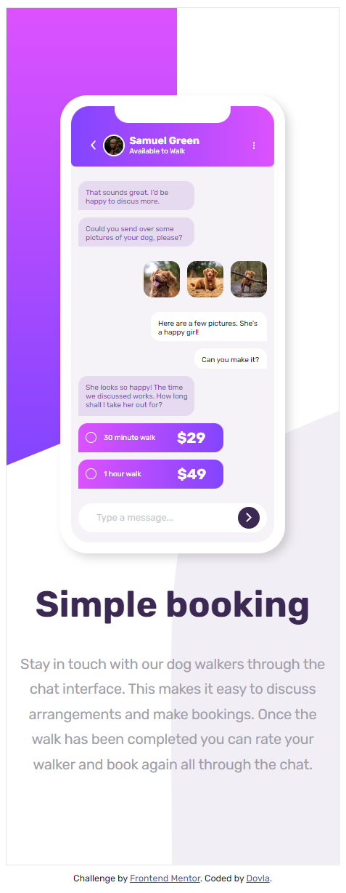
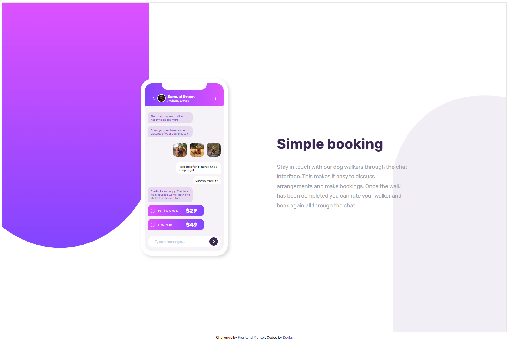
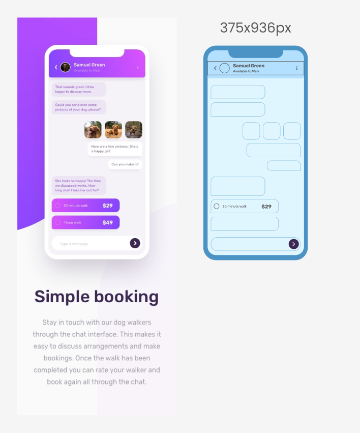

# Frontend Mentor - Chat app CSS illustration solution

This is a solution to the [Chat app CSS illustration challenge on Frontend Mentor](https://www.frontendmentor.io/challenges/chat-app-css-illustration-O5auMkFqY). Frontend Mentor challenges help you improve your coding skills by building realistic projects.

## Table of contents

- [Overview](#overview)
  - [The challenge](#the-challenge)
  - [Screenshot](#screenshot)
  - [Links](#links)
- [My process](#my-process)
  - [Built with](#built-with)
- [Author](#author)

## Overview

### The challenge

Users should be able to:

- View the optimal layout for the component depending on their device's screen size

### Screenshot

### Links

- Solution URL: [Click here](https://www.frontendmentor.io/solutions/chat-app-css-illustration-ztRpvqjrer)
- Live Site URL: [Click here](https://peaceful-smakager-113117.netlify.app)

## My process

I used Figma to recreate everything. It was huge help for me to code when I had the design in front of me 😊 and I recommend everyone to do the same! 🤠

Design Process:

- Understand the problem statement and requirements of the coding challenge.
- Break down the problem into smaller sub-problems and identify the data structures and algorithms that can be used to solve them.
- Create a rough plan or algorithm for solving the problem.
- Identify potential edge cases and devise a plan to handle them.

Coding Process:

- Write clean, well-organized, and readable code that implements the plan or algorithm designed in the design process.
- Test the code with sample inputs and edge cases to ensure it is working correctly and efficiently.
- Submit the solution to the coding challenge.

### Built with

- Semantic HTML5 markup
- CSS custom properties
- Flexbox
- Mobile-first workflow

## Author

- Website - [Vlado](https://dovla.me)
- Frontend Mentor - [@D0vl4](https://www.frontendmentor.io/profile/yourusername)
- GitHub - [D0vl4](https://github.com/D0vl4)
